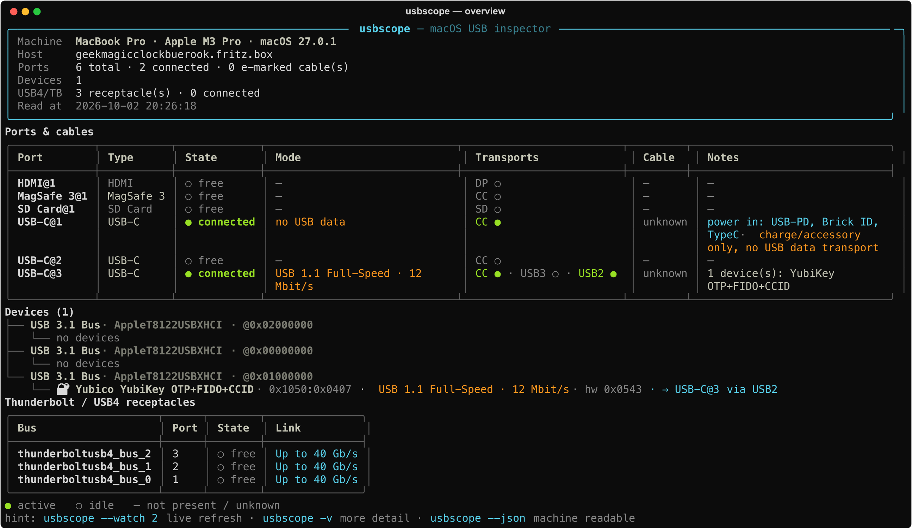
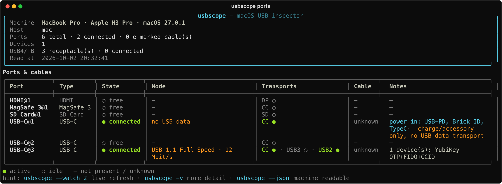
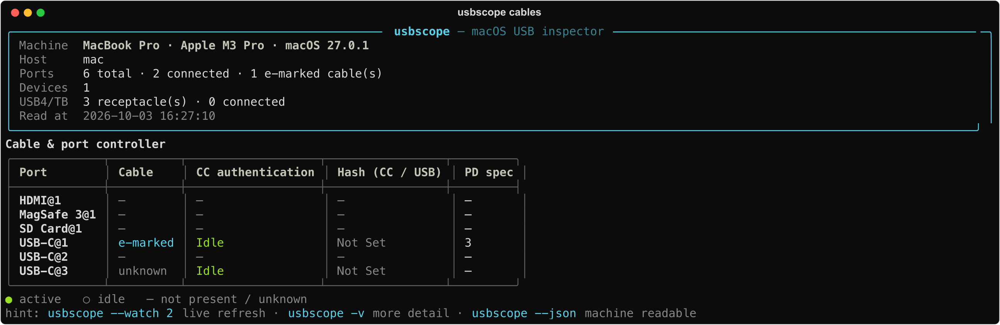
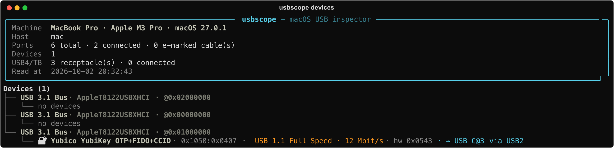
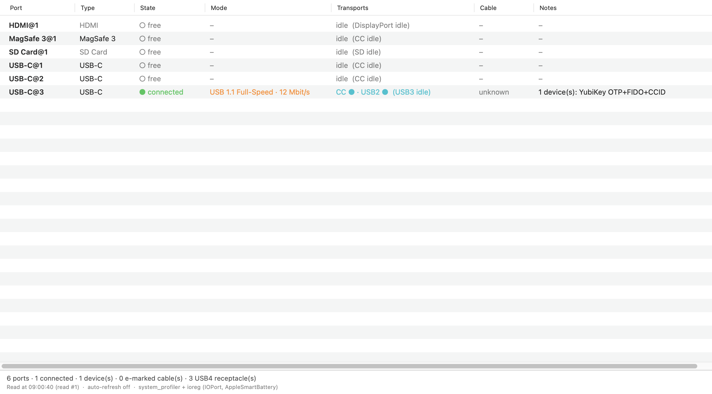

# usbscope

macOS CLI and native app that show the USB subsystem of a Mac: every receptacle
and its negotiated link mode, the attached devices and what the port controller
knows about the cable (e-marker/SOP, CC authentication, liquid detection).



Swift only — `swift build` and `swift test` are the whole toolchain. The
authoritative documentation is [docs/index.md](docs/index.md).

## Ports & cables

Every receptacle with its state, the negotiated USB mode, the active/idle
transports (CC, USB2, USB3, DisplayPort), the cable class, and notes: attached
devices, DisplayPort alt mode, power delivery, liquid detection, macOS
restrictions.



## Cables & port controller



## Devices



## A native macOS app

The same data in a real SwiftUI window (`usbscope-app`) with **nine tabs** —
Ports · Cables · Devices · Thunderbolt · Power · Timeline · Security · USB4 ·
Diff — plus search and filter presets, group-by, a column chooser, a details
sheet, auto-refresh, a menu bar extra, notification banners, an About window and
preferences.



```console
$ make swift-run-app              # run the app from the checkout
$ make snapshot                   # render the app window to docs/screenshots/
$ make swift-app-bundle           # → dist/usbscope-swift.app (ad-hoc signed)
$ open dist/usbscope-swift.app
```

Connect/disconnect banners only appear from the bundled app — macOS refuses the
notification request from a non-bundled process (see
[docs/index.md](docs/index.md)).

## Install & run

Requires macOS 14.4+ and Swift 6 (Xcode or the command line tools).

```console
$ swift build                     # build the CLI and the app
$ swift run usbscope              # overview
$ swift run usbscope ports -v     # port table with per-transport detail
$ swift run usbscope cables       # e-marker, CC authentication, liquid detection
$ swift run usbscope --json       # machine-readable snapshot
$ swift test                      # the suite (fixtures + frozen golden JSON)
```

Four scriptable commands turn the inspector into something a test rig can use:
`check --expect …`, `watch --events`, `baseline save|check <file>` and
`report [--format md|html] [--out file]`. `make` (or `make help`) lists every
developer task.

## Build & verify

```console
$ make                            # list the tasks (self documenting)
$ make doctor                     # swift, codesign, plutil, hdiutil, icon?
$ make check                      # the gates: swift build + swift test
$ make swift-app-bundle           # dist/usbscope-swift.app (release, ad-hoc signed, verified)
$ make swift-app-dmg              # → dist/usbscope-swift-<version>-macos-<arch>.dmg (hdiutil, unsigned)
```

CI (`.github/workflows/ci.yml`) runs `swift build` + `swift test` on every push
and pull request on a `macos-14` runner, and builds/uploads the app bundle on
`main`. Signing and notarisation — and what is still missing — are in
[docs/distribution.md](docs/distribution.md); the Mac App Store path in
[docs/app-store.md](docs/app-store.md).

macOS only. No sudo, no private frameworks, no entitlements. The data comes from
`system_profiler` and the IORegistry: `ioreg -p IOPort` is read **in-process**
through IOKit by default, with the `/usr/sbin/ioreg` subprocess kept as a
fallback.

There is **no prebuilt binary** — no signed or notarised release is published
yet, so build from source with `swift build`. What a real release still needs is
listed in [docs/distribution.md](docs/distribution.md).
# Product and support contract

usbscope is a local-only diagnostic tool for four audiences: people
troubleshooting a cable or charge/data issue, developers inspecting negotiated
USB state, IT administrators collecting repeatable machine snapshots, and
privacy-conscious users who need to see exactly what is exported. The Overview
answers the first three questions—what is connected, where it is connected, and
what mode is negotiated—before specialist views.

Security findings are observations and heuristics, not malware detection or a
security verdict. Missing identifiers mean that macOS did not report them; they
do not prove a device is malicious.

## Compatibility matrix

| Configuration | Status | Notes |
| --- | --- | --- |
| macOS 14.4+ | supported | Minimum package target |
| Current macOS on Apple Silicon | tested | In-process IOKit reader preferred |
| Current macOS on Intel | supported | Subprocess fallback retained |
| Sandboxed bundle | supported where APIs are available | Unsupported sources are reported as partial/failed |
| Direct bundle / CLI | supported | Uses absolute system-tool paths and bounded subprocess reads |

Source availability varies by Mac model and OS release. Unknown fields are
non-fatal and remain unavailable rather than being guessed. Snapshot JSON keeps
schema version 1 for compatibility; loaders reject unsupported versions with a
useful error. Diagnostic bundles use a separate format version and redact
serials, host names, location IDs, paths, and event identities by default.

The app records no network telemetry. Local diagnostic timing can include total
read duration, per-source status, warnings, and subprocess timings.

Further contracts are documented in [the product brief](docs/product-brief.md),
[the failure matrix](docs/failure-matrix.md), [the privacy inventory](docs/privacy-inventory.md),
and [the hardware capture matrix](docs/capture-matrix.md). Performance and
refresh caching policy is documented in [docs/performance.md](docs/performance.md).
